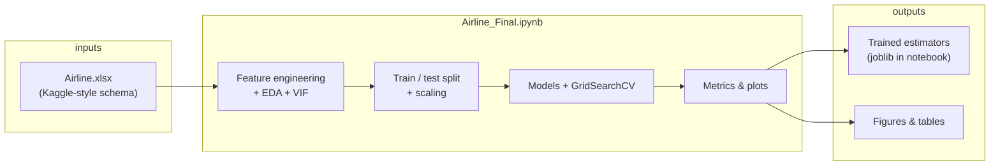
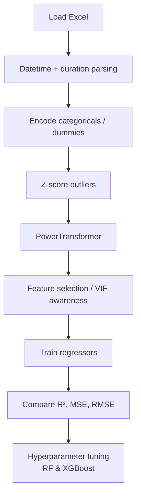
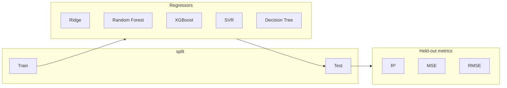

# Flight price prediction (India domestic)

[](https://opensource.org/licenses/MIT)
[](https://www.python.org/downloads/)
[](https://github.com/Vedv7/Predicting-flight-rates-through-advanced-regrression/actions/workflows/ci.yml)

End-to-end regression study on Indian domestic flight fares: preprocessing, EDA, multicollinearity checks, several regressors (Ridge, Random Forest, XGBoost, SVR, Decision Tree), and hyperparameter tuning. The full narrative and code live in [`Airline_Final.ipynb`](Airline_Final.ipynb).

**Short GitHub description (for “About”):**  
Indian domestic flight fare regression — sklearn + XGBoost, PowerTransformer + Z-score cleaning, full EDA in Jupyter.

---

## Table of contents

- [Executive summary](#executive-summary)
- [System architecture](#system-architecture)
- [Modeling workflow](#modeling-workflow)
- [Results snapshot](#results-snapshot)
- [Dataset](#dataset)
- [Repository layout](#repository-layout)
- [Local development](#local-development)
- [Reproducibility and CI](#reproducibility-and-ci)
- [Roadmap](#roadmap)
- [License](#license)

---

## Executive summary

Airlines set opaque, dynamic prices. This project builds supervised regression models on historical domestic India routes so you can quantify which levers (carrier, stops, calendar features, duration) correlate with ticket price, and which algorithms explain variance best on the held-out set.

| Design goal | How it is addressed |
|-------------|---------------------|
| Traceability | Single notebook documents data → features → models → metrics. |
| Robustness | Z-score outlier handling, `PowerTransformer` for skewed numeric features. |
| Comparison | Multiple algorithms with shared train/test split and R² / MSE / RMSE. |
| Tuning | `GridSearchCV` on Random Forest and XGBoost (see notebook). |

---

## System architecture

High-level components: data on disk, feature engineering and training in the notebook, optional serialized model for reuse.



---

## Modeling workflow



### Evaluation and model selection



---

## Results snapshot

Reported on the test split in the notebook (see section **Model Performance Results** for full tables):

| Algorithm | R² | RMSE (price units) |
|-----------|-----|----------------------|
| XGBoost Regressor | **0.724** | **2439.09** |
| Random Forest | 0.698 | 2549.49 |
| Ridge | 0.572 | 3038.63 |
| Decision Tree | 0.557 | 3090.65 |
| SVR | 0.032 | 4570.85 |

After tuning, Random Forest reaches about **74%** explained variance, competitive with XGBoost on this slice of experiments.

---

## Dataset

This project matches the **Kaggle “Flight Price Prediction”** training schema (`Data_Train.xlsx` from the competition bundle): `Airline`, `Date_of_Journey`, `Source`, `Destination`, `Route`, `Dep_Time`, `Arrival_Time`, `Duration`, `Total_Stops`, `Additional_Info`, `Price` (10 683 rows in the standard file).

**Recommended layout**

1. Copy your training workbook to **`data/Data_Train.xlsx`** in the repo root (same schema as `Airline.xlsx` in the original notebook).
2. The notebook loads **`data/Data_Train.xlsx` first**, and falls back to **`Airline.xlsx`** in the project root if that path is missing.
3. The CLI `flight-train` uses **`data/Data_Train.xlsx` by default** when `--data` is omitted and that file exists.
4. `*.xlsx` is gitignored so your copy of the data stays local and is not committed.

You can keep a second copy anywhere (for example under Downloads); the project only needs the file under `data/` for the default paths above.

---

## Repository layout

```text
.
├── data/                  # Local Data_Train.xlsx (gitignored)
├── src/flight_prices/     # Library + training CLI
├── api/main.py            # FastAPI inference (optional)
├── Airline_Final.ipynb    # Full EDA + modeling narrative
├── pyproject.toml
├── requirements.txt
├── LICENSE
├── README.md
├── tests/
│   └── fixtures/          # Synthetic CSV for CI
└── .github/workflows/
    └── ci.yml
```

---

## Local development

```powershell
git clone https://github.com/Vedv7/Predicting-flight-rates-through-advanced-regrression.git
cd Predicting-flight-rates-through-advanced-regrression
python -m venv .venv
.\.venv\Scripts\activate
pip install -e ".[dev,api]"
# Place Kaggle training data at data/Data_Train.xlsx, then:
flight-train
jupyter notebook Airline_Final.ipynb
```

On Linux or macOS, replace the activate line with `source .venv/bin/activate`.

---

## Reproducibility and CI

GitHub Actions (`.github/workflows/ci.yml`) installs `requirements.txt`, runs `python -m compileall` on `tests/`, and runs `pytest` on import smoke tests. **The notebook is not executed in CI** because the Excel file is not stored in the repository; run the notebook locally after adding the data file.

---

## Roadmap

| Priority | Item |
|----------|------|
| P1 | Pin exact dependency versions in a `requirements-lock.txt` after a clean full run. |
| P1 | Refactor training into importable modules + small CLI for batch prediction. |
| P2 | Add `nbstripout` or pre-commit to keep committed notebooks free of huge outputs. |
| P2 | Optional Streamlit or FastAPI scoring app using the best `joblib` model. |
| P3 | External features (holidays, fuel proxies) for stronger generalization. |

---

## License

This project is licensed under the [MIT License](LICENSE).

---

## Author

**Veda Swaroop** — AI / ML engineering, applied regression, agentic systems.

---

### Note on the repository name

The GitHub slug currently contains a typo (`regrression`). Renaming the repository to `Predicting-flight-rates-through-advanced-regression` (and updating the clone URL) is optional but improves discoverability and links.
